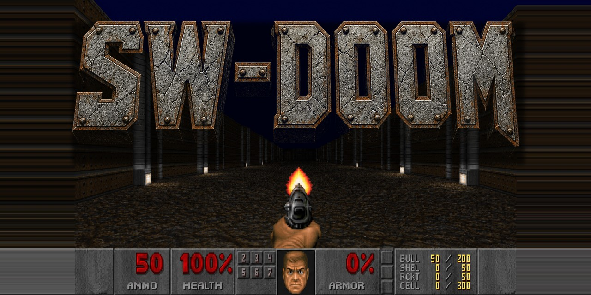

# SW-Doom



Mac SDL2 port of id Software's linuxdoom 1.10.

This repo is source plus the signed social image. It does not ship IWADs or a prebuilt `swdoom`. Commercial Doom data stays off GitHub. Freedoom is what you fetch yourself.

## Build

Needs clang, pkg-config, and SDL2. On macOS with Homebrew:

```
brew install sdl2
make -C linuxdoom-1.10
```

That writes `./swdoom`.

## IWAD

Put a Freedoom Phase 1 IWAD at `wads/freedoom1.wad`. Get it from [Freedoom](https://freedoom.github.io/) and copy `freedoom1.wad` into `wads/`.

Do not commit WAD files.

## Run

```
./swdoom -iwad wads/freedoom1.wad
```

## License

- Engine: GNU GPL v2. See `LICENSE.TXT` and `id-README.TXT`.
- Freedoom data, once you fetch it, uses the grant in `wads/COPYING.txt`.
